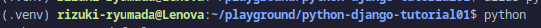

# Django Tutorial01
In this repository, I followed a Django tutorial from the official site. Here is the link: https://docs.djangoproject.com/en/4.0/intro/tutorial01/

This README provides the log what I've done with this repository. This repository also the result of my study in that tutorial.

**Table of Content**
- [Initial Steps](#initial-steps)
  - [1. Create a Virtual Environment](#1-create-a-virtual-environment)
  - [2. Install the packages in `requirement.txt`](#2-install-the-packages-in-requirementtxt)
  - [3. Create a project](#3-create-a-project)
  - [4. The development server](#4-the-development-server)
  - [5. Start the development](#5-start-the-development)

## Initial Steps
See this link to see the full explanation: https://docs.djangoproject.com/en/4.0/intro/tutorial01/

### 1. Create a Virtual Environment
Let's start this learn by creating your virtual environment (venv). Please refer to this link to see how to make it: https://gist.github.com/ryumada/c22133988fd1c22a66e4ed1b23eca233

The result in terminal view showing virtual environment name:



### 2. Install the packages in `requirement.txt`
```bash
pip install -r requirement.txt
```

### 3. Create a project
```bash
django-admin startproject mysite
```

### 4. The development server
Change the directory into mysite, then running this command:
```bash
python manage.py runserver
```

This will run the server into http://127.0.0.1:8000.

If you want to run the server on another port, you can run a command like this:
```bash
python manage.py runserver 8080
```

If you want the server listens to all available public IP with port 8000:
```bash
python manage.py runserver 0:8080
```
> 0 is a shortcut of 0.0.0.0

### 5. Start the development
Make sure you are in the same directory as `manage.py`, then type this command.
```bash
python manage.py startapp polls
```
That'll create a new directory **polls**.


